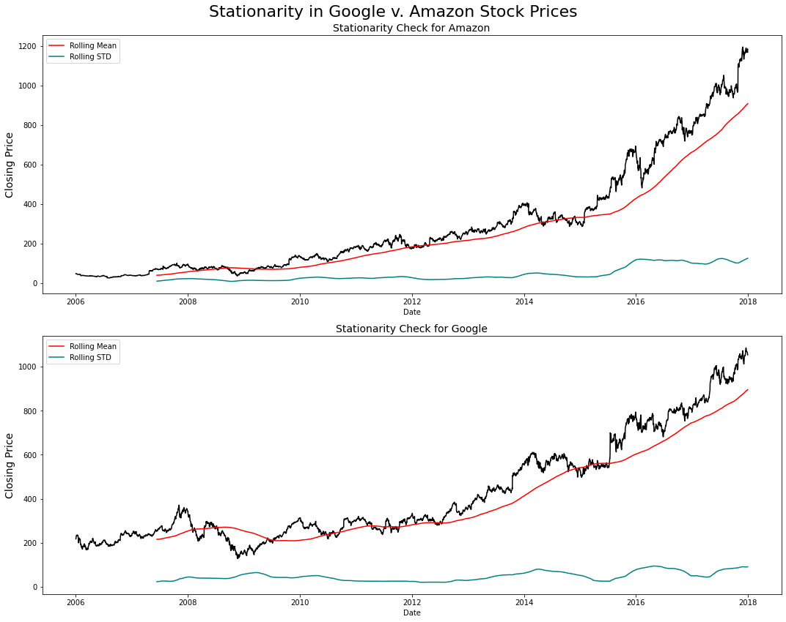
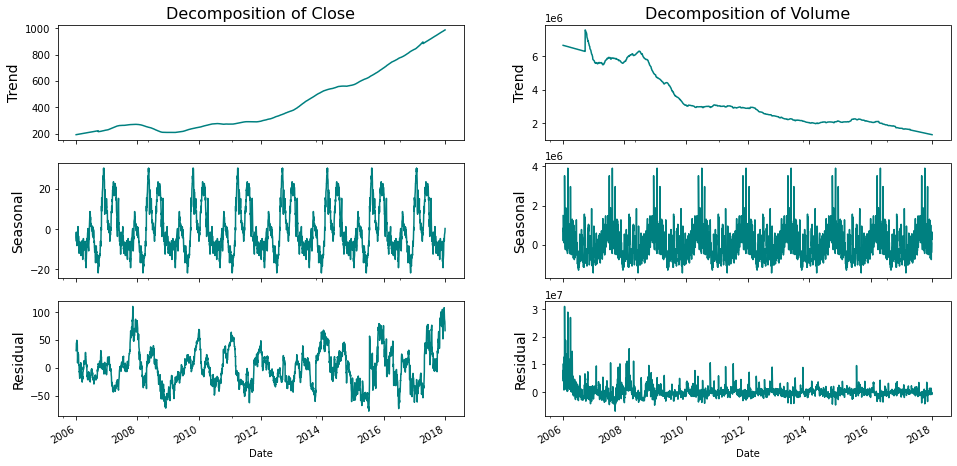
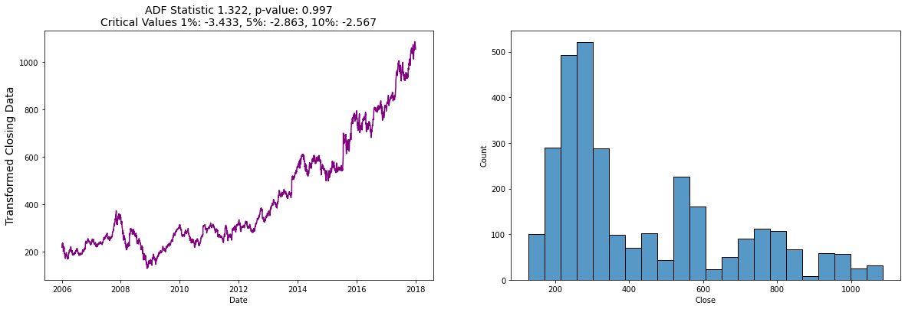
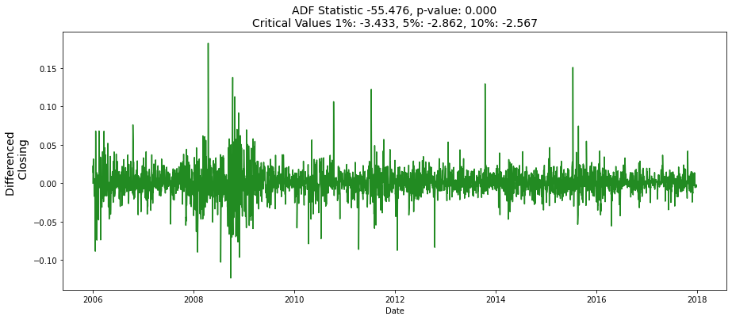

# Time_Series_ARIMA
This was a small passion project involving stock market predictions using an ARIMA model.

## Overview

This data is stock market information spanning from 2006 to 2019 across over 30 companies.  The data was taken from Kaggle which can be found [here](https://www.kaggle.com/camnugent/sandp500?select=all_stocks_5yr.csv).  Out of all the companies the final anlysis was focused on google.  I wanted to try to simplify this as much as possible since it was my first time working with time series. 

## Stationarity

Stationarity in our model tells us how predictable or reliable it will be.  Testing for stationarity was a common first step that I found everywhere when I started researching time series.  **Stochasticity** is the measurement of *how much* stationarity a time series has.  It is a variable or process that has uncertainty in it.  A stationary time series makes predictiions pretty straight forward where as a stochastic time series makes outcomes harder to predict.

Below are the rolling means and standard deviations of Google and Amazon Closing prices in the US Stock Market.

## Seasonality

Seasonality is a pretty straight forward concept.  It takes into account that there will be seasonal highs and lows.  A common practice for understanding the seasonality of a time series model is by creating a decomposition chart. From looking at this chart we can inference the overall trend.  The linear trend of the closing price on the left is a positive linear trend.  The seasonality in the middle exhibiits a patteren of seasonal highs and lows.  The bottom graph exhibiting residuals displays how far from the overall trend the individual data points have deviated.  

## AD Fuller Test

We test for stationarity to confirm the suspicions with and Augmented Dickey Fuller Test.  ADF is a form of hypothesis testing used to test for the presence of what is known as a uit root.  The unit root or a unit root process is a stochastic trend in time series. The presence of this unit root implies unpredictability.

The hypotheses of these tests are:

*𝐻0: "Process has unit root".*

*𝐻a: "Process has NO unit root".*

The test statistic is: **1.322424**. 
Now you need to compare this with the critical values under 𝐻0.

The Critical Values are given with:

1%:−3.433 | 5%:−2.863 | 10%:−2.567

Since your test statistic is higher than all of the critical values you fail to reject 𝐻0 at a significance level > 0.05 and reject 𝐻a. You can conclude that your time series has a unit root, or unit root process. Statistically speaking, your process is not stationary. So, you fail to reject 𝐻0.

## Differencing

Differencing is a method that can be used to remove stochasticity.
When differencing this data, I was able to acheive a perfectly straight line, that for all intensive purposes could be a rolling mean.

## Model

An Arima Model was used for this time series.

The Auto-Regressive Integrated Moving Average (ARIMA) model describes the **autocorrelations** in the data. The model assumes that the time-series is **stationary**. It consists of three main parts:

|p|d|q|
|---|---|---|
|AR|I|MA|
|Auto-Regressive (AR) filter (long term)|Integration filter (stochastic trend)|Moving Average (MA) filter (short term)|

* **Step 1 — Check stationarity**: If a time series has a trend or seasonality component, it must be made stationary before we can use ARIMA to forecast. .
* **Step 2 — Difference**: If the time series is not stationary, it needs to be stationarized through differencing. Take the first difference, then check for stationarity. Take as many differences as it takes. Make sure you check seasonal differencing as well.
* **Step 3 — Filter out a validation sample**: This will be used to validate how accurate our model is. Use train test validation split to achieve this
* **Step 4 — Select AR and MA terms**: Use the ACF and PACF to decide whether to include an AR term(s), MA term(s), or both.
* **Step 5 — Build the model**: Build the model and set the number of periods to forecast to N (depends on your needs).
* **Step 6 — Validate model**: Compare the predicted values to the actuals in the validation sample.

## Predictions

## Issues

I had a lot of issues with the syntax for getting predictions and plots of predictions.  This is something that required a lot of extra reading and understanding what I was doing wrong witht the model.  Syntactical issues continue to exist with modeling and predictions that are more user error than the programming language itself.  **WORK IN PROGRESS**

## Conclusion

